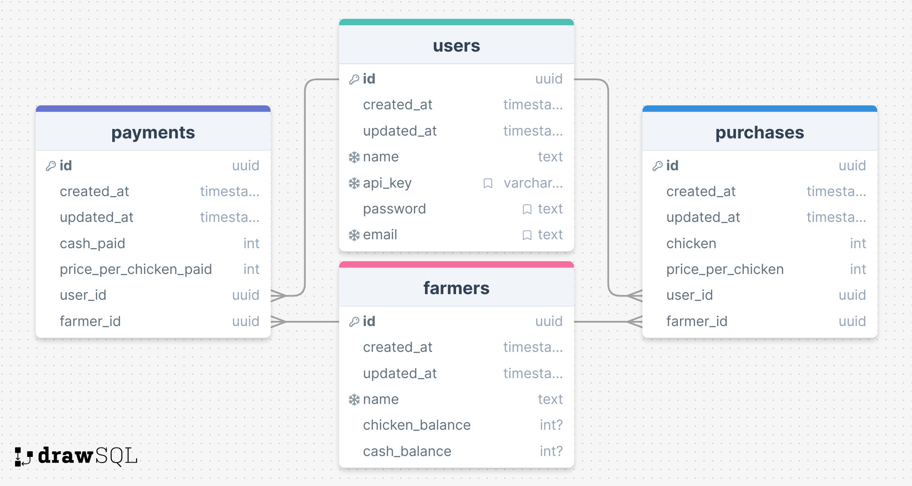

# Database Schema

This document outlines the structure of the database for the White Point inventory management system

## Users

The `users` table stores user account information including user ID, user email and password among other details

| Column     | Type      | Description                |
|------------|-----------|----------------------------|
| id         | UUID      | Unique user ID             |
| created_at | TIMESTAMP | Account creation timestamp |
| updated_at | TIMESTAMP | Last update timestamp      |
| name       | TEXT      | Name of user               |
| apikey     | VARCHAR   | User`s API key             |
| password   | TEXT      | User password              |
| email      | TEXT      | User's email address       |

## Farmers

The `farmers` table stores farmer information including farmer ID, chicken and cash balances among other details

| Column          | Type      | Description               |
|-----------------|-----------|---------------------------|
| id              | UUID      | Unique farmer ID          |
| created_at      | TIMESTAMP | Farmer creation timestamp |
| updated_at      | TIMESTAMP | Last update timestamp     |
| name            | TEXT      | Name of farmer            |
| chicken_balance | INT       | Chicken balance           |
| cash_balance    | INT       | Cash owed to farmer       |

## Purchases

The `purchases` table stores purchase information including purchase ID, chicken number and chicken price among other details

| Column            | Type      | Description                 |
|-------------------|-----------|-----------------------------|
| id                | UUID      | Unique purchase ID          |
| created_at        | TIMESTAMP | Purchase creation timestamp |
| updated_at        | TIMESTAMP | Last update timestamp       |
| chicken           | INT       | Chicken bought              |
| price_per_chicken | INT       | Price chicken is bought at  |
| user_id           | UUID      | Associated user ID          |
| farmer_id         | UUID      | Associated farmer ID        |

## Payments

The `payments` table stores payment information including payment ID, cash paid and chicken price paid among other details

| Column                 | Type      | Description                  |
|------------------------|-----------|------------------------------|
| id                     | UUID      | Unique purchase ID           |
| created_at             | TIMESTAMP | Purchase creation timestamp  |
| updated_at             | TIMESTAMP | Last update timestamp        |
| cash paid              | INT       | Cash paid to farmer          |
| price_per_chicken_paid | INT       | Price chicken was bought for |
| user_id                | UUID      | Associated user ID           |
| farmer_id              | UUID      | Associated farmer ID         |

